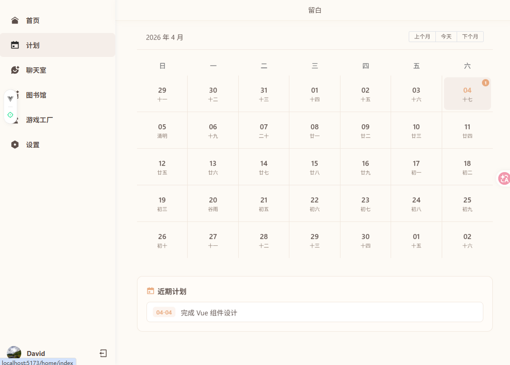
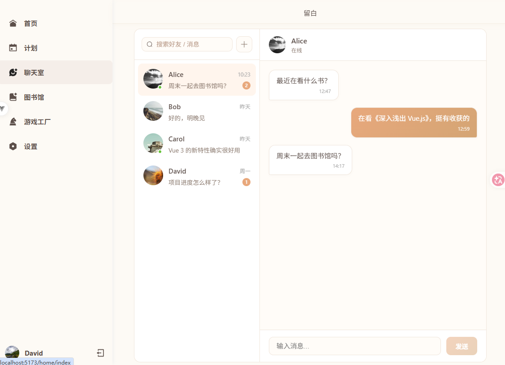
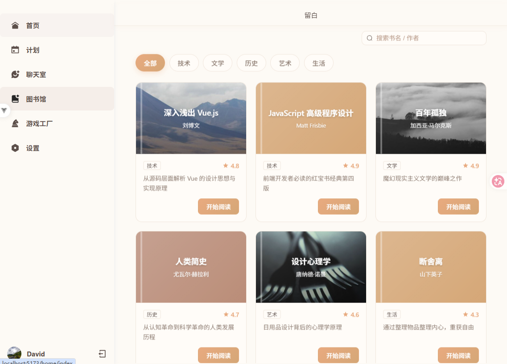
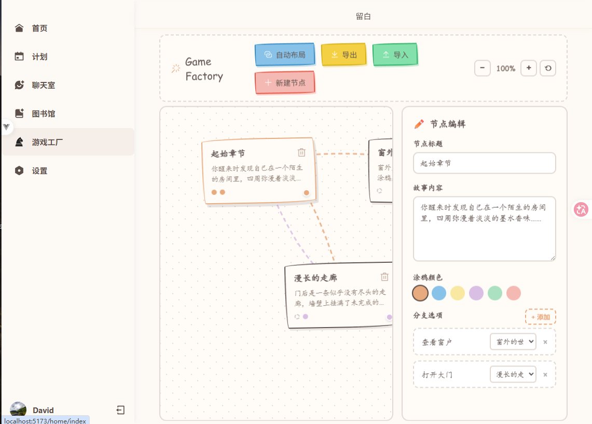

# TimeMaster ⏰

一个基于 Vue 3 的个性化时间管理应用，集时钟展示、日历计划、聊天室、图书馆、游戏工厂于一体，帮助你高效管理时间，享受留白的艺术。


---

## ✨ 功能特性

- 🕐 **Canvas 时钟** - 精美的动态时钟展示，支持高清屏适配
- 📅 **日历计划** - 支持农历显示，记录你的每日计划
- 💬 **聊天室** - 与好友即时通讯，支持消息提醒
- 📚 **图书馆** - 管理你的阅读清单，分类浏览书籍
- 🎮 **游戏工厂** - 可视化剧情编辑器，创造你的互动故事
- 🌓 **暗黑模式** - 支持亮色/暗黑主题切换
- 📱 **响应式设计** - 适配桌面、平板、手机多种设备

---

## 🖼️ 项目展示

### 计划页面
支持公历/农历双显示的日历组件，轻松管理每日计划与待办事项。



### 聊天室
实时聊天界面，支持好友列表、消息搜索、未读消息提醒。



### 图书馆
书籍管理系统，支持分类筛选、评分展示、阅读进度跟踪。



### 游戏工厂
可视化剧情编辑器，通过拖拽节点创建分支剧情，支持导出/导入。



---

## 🛠️ 技术栈

| 类别 | 技术 |
|------|------|
| **前端框架** | Vue 3.5 (Composition API + `<script setup>`) |
| **构建工具** | Vite 7.3 |
| **类型系统** | TypeScript 5.9 |
| **状态管理** | Pinia 3.0 |
| **路由** | Vue Router 4.6 |
| **UI 组件库** | Element Plus 2.13 |
| **CSS 预处理器** | Sass 1.97 |
| **工具库** | VueUse 14.1 |
| **特效** | tsParticles |
| **农历** | lunar-javascript |

---

## 🚀 快速开始

### 环境要求

- Node.js: ^20.19.0 || >=22.12.0
- npm

### 安装

```bash
# 克隆项目
git clone <repository-url>
cd time-master

# 安装依赖
npm install
```

### 开发

```bash
# 启动开发服务器
npm run dev
```

应用将运行在 http://localhost:5173

### 构建

```bash
# 类型检查并构建生产版本
npm run build

# 仅构建（跳过类型检查）
npm run build-only

# 预览生产构建
npm run preview
```

---

## 📁 项目结构

```
src/
├── assets/              # 静态资源
│   ├── img/            # 图片资源
│   └── logo.svg
├── components/         # 组件
│   ├── Clock.vue       # Canvas 时钟组件
│   ├── LoginForm.vue   # 登录表单
│   ├── MusicPlayer.vue # 音乐播放器
│   ├── Sidebar.vue     # 侧边导航栏
│   ├── effects/        # 特效组件
│   │   └── Star.vue    # 粒子星空背景
│   ├── icons/          # 图标组件
│   └── plan/
│       └── Plan.vue    # 日历计划组件
├── composables/        # 组合式函数
│   ├── useGlobalTheme.ts  # 全局主题切换
│   └── useLogin.ts        # 登录逻辑
├── router/             # 路由配置
│   └── index.ts
├── stores/             # Pinia 状态仓库
│   └── useUserStore.ts
├── styles/             # 样式文件
│   ├── base.css        # CSS 变量
│   ├── index.scss      # Element Plus 主题
│   └── main.css
├── types/              # TypeScript 类型
├── utils/              # 工具函数
├── views/              # 页面视图
│   ├── LoginView.vue
│   ├── HomeLayout.vue
│   ├── HomeIndex.vue
│   ├── AboutView.vue   # 聊天室
│   ├── PlanView.vue    # 计划
│   ├── GameFactoryView.vue
│   ├── LibraryView.vue
│   └── SettingView.vue
├── App.vue
└── main.ts
```

---

## 🎨 主题系统

项目支持亮色/暗黑双主题：

- **亮色主题**：米黄色背景 (#FDFAF5)，温暖舒适
- **暗黑主题**：深黑渐变背景，配合粒子星空特效
- **切换方式**：使用 VueUse 的 `useDark`，自动持久化到 localStorage

---

## 📄 许可证

[MIT](LICENSE)

---

## 🙏 致谢

- [Vue.js](https://vuejs.org/)
- [Element Plus](https://element-plus.org/)
- [VueUse](https://vueuse.org/)
- [tsParticles](https://particles.js.org/)
